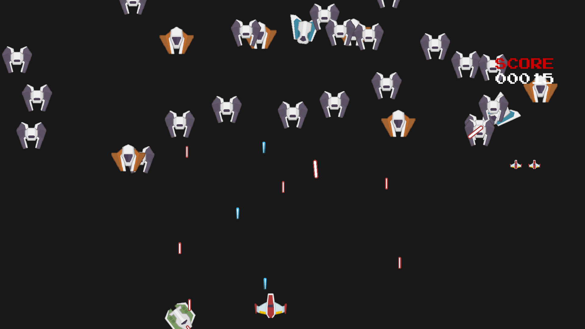

# Galaga Clone
## Description
Galaga is a Martian killer video game created in 1981 by the Namco company. It was designed as the successor to the Galaxian (1979). 
This repository contains a clone that mimics the most basic mechanics of the original video game, although not its appearance.  
  
  

The player controls a ship that must face a swarm of insect-shaped aliens that will attack him by firing bombs and acting as kamikazes. When you start the game, the aliens do not appear immediately. Instead, they appear doing pirouettes and then take a place in a formation.
## Installation
If you want to edit the game:  
1. Download untity from its official site https://unity3d.com/es/get-unity/download
2. Download Blender from official site https://www.blender.org/
3. Clone this repository `git clone https://github.com/santiagopemo/galaga-clone/`
4. When you have opened the project in Unity go to file -> Build Settings -> Build

## Usage
If you simply want to play it go to the following website where you will find the instructions    
[Galaga Clone Website](https://santiagopemo.github.io/galaga-clone/)  

## Author :pencil:
### Santiago Peña Mosquera  
Mechatronic engineer and student of software development in holberton school, lover of building new things from scratch, that's why my passion for programming, starting from an empty sheet and turning it into a solution for real problems.  
<a href="https://www.linkedin.com/in/santiago-pe%C3%B1a-mosquera-abaa20196/" target="_blank">LinkedIn</a>&nbsp;&nbsp;&nbsp;&nbsp;
<a href="https://twitter.com/santiagopemo" target="_blank">Twitter</a>
